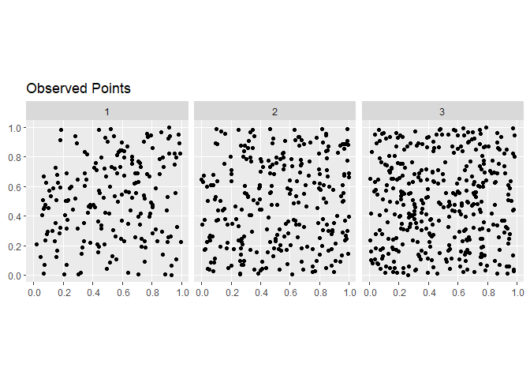
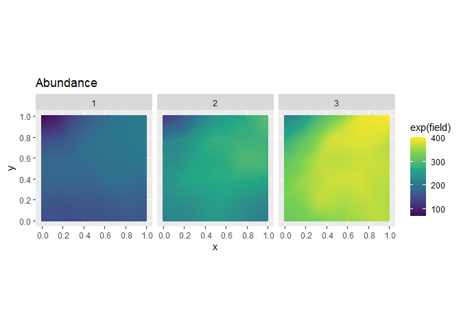

## INLAloggrowth

This is a R package to implement the Spatial Logistic Growth model
described in \[paper\]. It uses the `cgeneric` interface in `R-INLA` to
implement the model in `C` and uses `inlabru` to fit the spatial models.

## Installation

The ‘INLA’ package is needed for fitting a model. You can install it
with

``` r
install.packages("INLA",repos=c(getOption("repos"),INLA="https://inla.r-inla-download.org/R/testing"), dep=TRUE) 
```

You can install the latest version of INLAloggrowth from
[GitHub](https://github.com/ljb34/INLAloggrowth) with

``` r
## install.packages("remotes")
remotes::install_github("ljb34/INLALogisticGrowth")
```

## A simple example

Loading packages

``` r
library(INLA)
library(inlabru)
```

    ## Loading required package: fmesher

``` r
library(INLAloggrowth)
library(sf)
```

    ## Linking to GEOS 3.14.1, GDAL 3.12.1, PROJ 9.7.1; sf_use_s2() is TRUE

``` r
library(fmesher)
```

Simulate logistic growth data

``` r
simdata <- simulate_loggrowth(growth = 1, carry.cap = 500, movement = 0.15, sigma = 0.35,
                               initial.pop = 150, initial.range = 0.15, initial.sigma=0.075,
                               timesteps = 3,sample.type = "LGCP", boundaries = c(0,1), debug = T,
                               max.edge = 0.25)
library(ggplot2)
#Plot observations
ggplot()+
  gg(simdata$animal_obs)+
  facet_wrap(~time)+
  ggtitle("Observed Points")
```

<!-- -->

``` r
#Plot unobserved field
ggplot()+
  gg(simdata$animal, aes(fill = exp(field)), geom = "tile")+
  scale_fill_viridis_c()+
  facet_wrap(~time)+
  ggtitle("Abundance")
```

<!-- -->

Define spatial and temporal discretization meshes

``` r
bnd <- spoly(data.frame(easting = c(0,1,1,0), northing = c(0,0,1,1)), format = "sf")
mesh_space <- fm_mesh_2d(boundary = bnd,
                       max.edge = 0.25)
mesh_time <- fm_mesh_1d(
  loc = 0:3)
```

Fit a simple model to the first year. The output of this model becomes
the prior for the initial condition.

``` r
matern <- inla.spde2.pcmatern(mesh_space,
                              prior.sigma = c(0.5, 0.01),
                              prior.range = c(0.1, 0.02))
cmp <- geometry ~ smooth(geometry, model = matern) +
  initial(1,model = "linear")-1

first_fit <- bru(cmp, simdata$animal_obs[simdata$animal_obs$time == 1,],
                 family = "cp", domain = list(geometry = fm_subdivide(mesh_space,1)))
```

Extract mean and precision matrix

``` r
index <- min(which(stringr::str_sub(rownames(first_fit$summary.fitted.values),8,8)!= "A"))
n.nodes <- first_fit$misc$configs$nconfig
nodes <- data.frame(log.prob=rep(NA,n.nodes))
mat_list <- list()
mean_list <- list()
for(i in 1:n.nodes){
  nodes[i,]<- first_fit$misc$configs$config[[i]]$log.posterior
  Q <- first_fit$misc$configs$config[[i]]$Q[1:mesh_space$n, 1:mesh_space$n]
  dQ <- diag(Q)
  Q <- Q + Matrix::t(Q)
  diag(Q) <- dQ
  mat_list[[i]] <- Q
  mean_list[[i]] <- first_fit$misc$configs$config[[i]]$improved.mean[1:mesh_space$n]
}
nodes <- dplyr::mutate(nodes, weight = exp(log.prob)) %>%
  dplyr::mutate(weight.prob = weight/sum(weight))
Q <- Reduce("+", Map(function(m,w) w*m, mat_list,nodes$weight.prob))
initial.precision <-Diagonal(mesh_space$n,
                             1/((first_fit$summary.fixed$sd**2)+(first_fit$summary.fitted.values$sd[index-1 +1:mesh_space$n]**2)))%*%Q
weighted.means <- Map(function(v,p) v*p, mean_list, nodes$weight.prob)
prior.mean <- Reduce("+", weighted.means) + first_fit$summary.fixed$mean[1]
```

Fit logistic growth model

``` r
priors = list(cc = c(log(500), 0.5), growth = c(log(1), 0.5), 
              movement = c(log(0.15),0.5), sigma = c(log(0.5),0.5))
logistic_fit <- iterate.fit(formula = geometry + time ~ -1, #Need to remove intercept
                         data = simdata$animal_obs, family = "cp",
                         domain = list(geometry = fm_subdivide(mesh_space,1), time = 1:3),
                         smesh = mesh_space, tmesh = mesh_time, samplers = bnd,
                         prior.mean = prior.mean, 
                         prior.precision = Q,
                         priors = priors, initial.growth=log(1),
                         initial.carry.cap=log(500), initial.move.const = log(0.15),
                         initial.sigma = log(0.5), gamma = 0.5,
                         options = list(verbose = F, control.inla = list(strategy = "gaussian", int.strategy = "eb")))
```

Parameters on log scale. In order growth, carrying capacity, dispersal,
sigma

``` r
summary(logistic_fit$fit) 
```

    ## inlabru version: 2.14.0 
    ## INLA version: 26.04.26 
    ## Latent components:
    ## loggrow: main = cgeneric(list(space = geometry, time = time))
    ## Observation models:
    ##   Model tag: <No tag>
    ##     Family: 'cp'
    ##     Data class: 'sf', 'tbl_df', 'tbl', 'data.frame'
    ##     Response class: 'numeric'
    ##     Predictor: geometry + time ~ loggrow
    ##     Additive/Linear/Rowwise: TRUE/TRUE/TRUE
    ##     Used components: effect[loggrow], latent[] 
    ## Time used:
    ##     Pre = 0.27, Running = 0.834, Post = 0.11, Total = 1.21 
    ## Random effects:
    ##   Name     Model
    ##     loggrow CGeneric
    ## 
    ## Model hyperparameters:
    ##                      mean    sd 0.025quant 0.5quant 0.975quant   mode
    ## Theta1 for loggrow -0.298 0.276     -0.859   -0.292      0.228 -0.267
    ## Theta2 for loggrow  6.205 0.285      5.645    6.205      6.767  6.205
    ## Theta3 for loggrow -1.535 0.434     -2.368   -1.542     -0.660 -1.572
    ## Theta4 for loggrow -0.974 0.333     -1.676   -0.958     -0.369 -0.884
    ## 
    ## Marginal log-Likelihood:  3866.14 
    ##  is computed 
    ## Posterior summaries for the linear predictor and the fitted values are computed
    ## (Posterior marginals needs also 'control.compute=list(return.marginals.predictor=TRUE)')

Parameters on actual scale. In order growth, carrying capacity,
dispersal, sigma

``` r
exp(logistic_fit$fit$summary.hyperpar) 
```

    ##                           mean       sd   0.025quant    0.5quant  0.975quant
    ## Theta1 for loggrow   0.7422042 1.318043   0.42356296   0.7465159   1.2560263
    ## Theta2 for loggrow 495.4410774 1.329770 282.73723321 495.4066623 868.5127203
    ## Theta3 for loggrow   0.2154656 1.543476   0.09362589   0.2139606   0.5170592
    ## Theta4 for loggrow   0.3777242 1.395194   0.18716420   0.3835336   0.6915284
    ##                           mode
    ## Theta1 for loggrow   0.7658664
    ## Theta2 for loggrow 495.2629865
    ## Theta3 for loggrow   0.2075491
    ## Theta4 for loggrow   0.4130540
